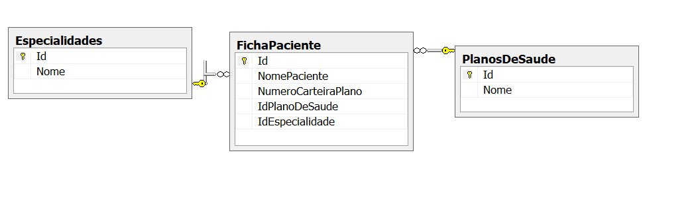

# Avaliação Estágio

## Problema:

Um hospital precisa de um sistema que faça a ficha do cliente e valide se o plano do beneficiário é válido para o atendimento solicitado.

- A solução deverá implementar um CRUD, inserindo, pesquisando com filtros, alterando e deletando a ficha. 
- A ficha do paciente deverá conter o nome do paciente, número da carteira, Especialidade desejada e o Plano de saúde.
- Os planos de saúde e as especialidades estão nas respectivas tabelas no banco de dados (PlanosDeSaude e Especialidades). Ambos devem ser um combo na tela.
- Ao salvar a solução deverá validar a seguinte regra ao inserir ou alterar:
	- Um paciente pode cadastrar apenas uma ficha para o mesmo plano e especialidade.
	- Caso exista uma duplicidade para o mesmo plano e especialidade o sistema deve exibir uma mensagem: “Esta especialidade X já foi utiliza para o plano Y”.
	- Caso não exista duplicidade o sistema deve registrar as informações no banco de dados.

## Banco de dados:

Utilizar um banco de dados para implementar o seguinte diagrama de entidade e relacionamentos:

